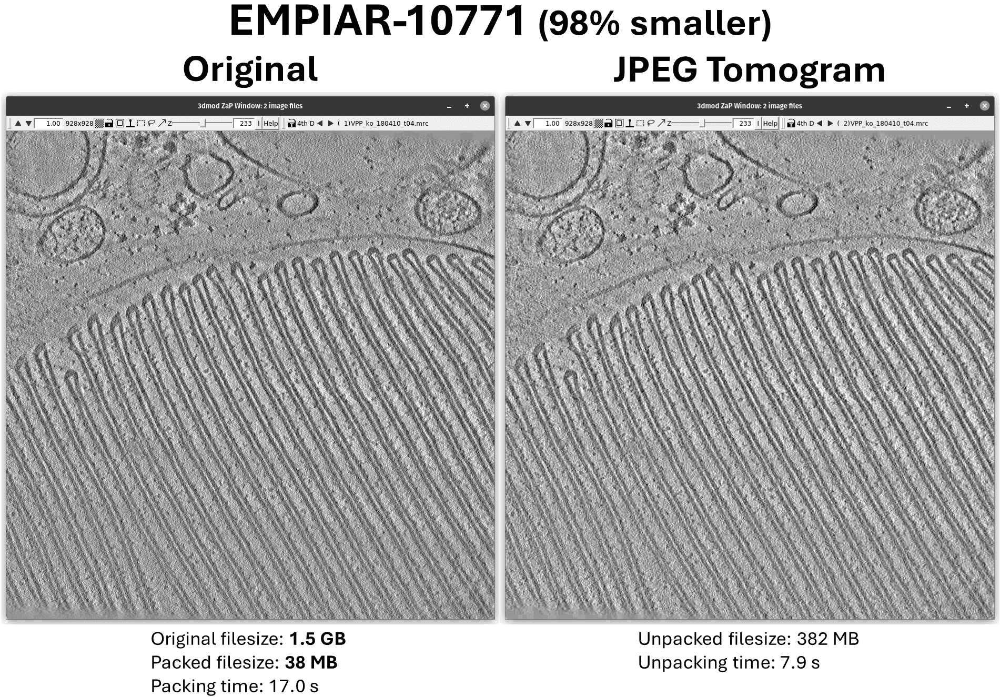
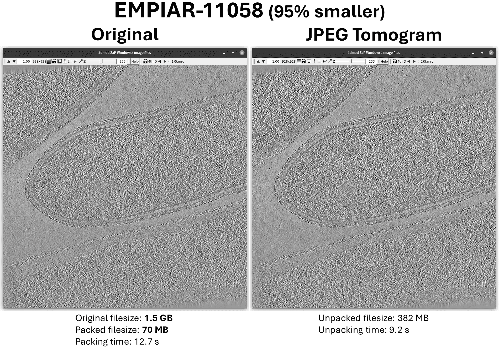
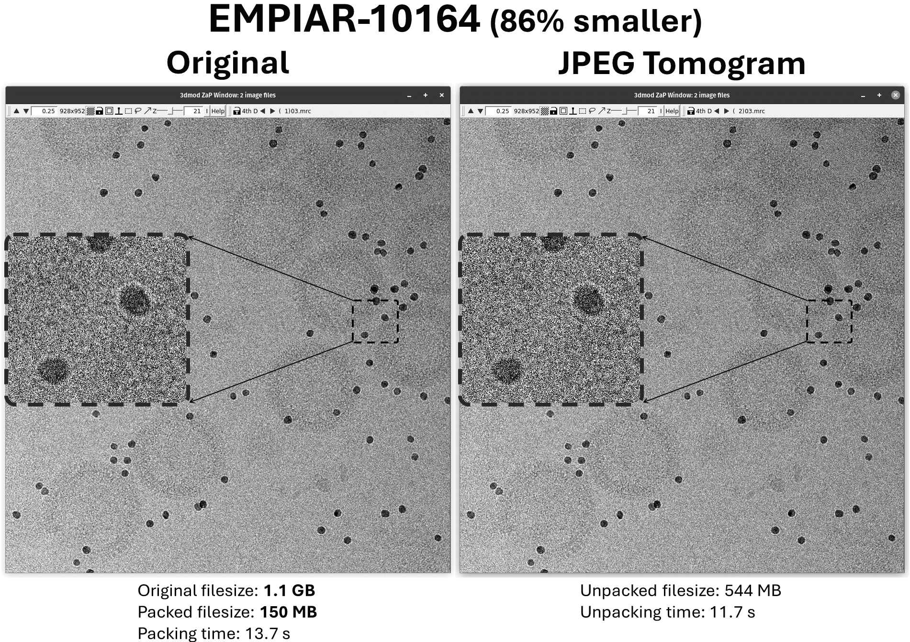

# JPEG Tomogram Conversion Script

Pack and unpack 3D MRC files to custom JPEG stacks and vice versa for visualization and to save space. By default, JPEG packing uses 80% quality, which reduces the size to ~10% of the original while making minimal visual impact to cryoET tomograms. This tool is intended for visualization and annotation of cryoET tomograms, which may be useful locally and for distributing tomograms for faster visual analysis and collaboration.

## Release Notes

### v1.0.0 - August 16, 2024

#### Features

- Initial release of this JPEG Tomogram script for packing/unpacking MRC files to/from JPEG stacks.
- Reduces tomogram sizes by 90+% with negligible impact on visual quality.
- Multi-core processing.

## Warning

This tool should not be used for downstream processing as the JPEG format causes a loss in precision.

## Requirements and Installation

This script requires Python 3 and several Python libraries. Install the libraries via pip:

```bash
pip install mrcfile numpy pillow tqdm
```

To use JPEG Tomogram, download the jpeg_tomogram.py file directly and place it in your working directory or environment for use. Make it executable on Linux with this command: `chmod +x jpeg_tomogram.py`.

## Usage

You can use this script to pack or unpack single files or entire directories. Here are some examples:

To pack a single MRC file into a JPEG stack:
```
./jpeg_tomogram.py pack tomogram.mrc
```

To pack a directory of MRC files into JPEG stacks:
```
./jpeg_tomogram.py pack tomograms/
```

To unpack a single JPEG stack into a MRC file:
```
./jpeg_tomogram.py unpack tomogram.jpgs
```

To unpack a directory of JPEG stacks into MRC files:
```
./jpeg_tomogram.py unpack tomograms/
```

## Arguments

- `-o`, `--output_path`: Specify the output file or directory. By default, the output will be saved in the same location as the input.
- `-e`, `--external_viewer`: Specify an external program to open the unpacked MRC file (e.g. 3dmod).
- `-q`, `--quality`: Specify the quality of the JPEG images in the stack. The default quality is 80. Values above 95 should be avoided.
- `-c`, `--cores`: Specify the number of CPU cores to use. By default, the script will use all available cores.
- `-V`, `--verbose`: Enable verbose output.
- `--quiet`: Quiet mode (ie. no terminal output).
- `-v`, `--version`: Show version number.

## Example with Options

Here is an example of using the script with some optional arguments:

```
./jpeg_tomogram.py pack tomogram.mrc -o output_directory/ -q 90 -c 4 -V
```

This command will do the following:

- `pack`: This is the mode you are using. It can be either pack (to convert MRC files to JPEG stacks) or unpack (to convert JPEG stacks to MRC files).
- `tomogram.mrc`: This is the input tomogram. The script will convert this MRC file into a custom JPEG stack.
- `-o output_directory/`: This is an optional argument that specifies the output directory. The script will save the output JPEG stack in this directory. If you don't use the -o option, the script will save the output in the same directory as the input.
- `-q 90`: This is an optional argument that sets the quality of the JPEG images in the stack. The quality can be any integer from 1 to 100, with higher numbers meaning better quality (but larger file sizes). If you don't use the -q option, the default quality is 80.
- `-c 4`: This is an optional argument that sets the number of CPU cores to use. The script can use multiple cores to process images faster. If you don't use the -c option, all available cores are used.
- `-V`: This is an optional argument that enables verbose output. If you use the -V option, the script will print more detailed messages about what it's doing.

In this example, the script will pack the `tomogram.mrc` file into a JPEG stack with a quality of 90. The output will be saved in `output_directory/`. The script will use 4 CPU cores, and verbose output will be enabled.

## Examples

### Example 1:


### Example 2:


### Example 3:


All examples use 80% JPEG quality.

## Requests

Please integrate this script/algorithm/idea into tomography viewing software - such as IMOD, Napari, Amira, Dragonfly, Dynamo - so that .jpgs files can be viewed natively without unpacking them back to large mrc files.

## Issues and Support

If you encounter any problems or have any questions about the script, please [Submit an Issue](https://github.com/alexjnoble/jpeg_tomogram/issues).

## Contributions

Contributions are welcome! Please open a [Pull Request](https://github.com/alexjnoble/jpeg_tomogram/pulls) or [Issue](https://github.com/alexjnoble/jpeg_tomogram/issues).

## Author

This script was written by Alex J. Noble with assistance from OpenAI's GPT-4 and Anthropic's Claude models, 2023-24 at SEMC.

## License

This project is licensed under the MIT License - see the [LICENSE](LICENSE) file for details.
